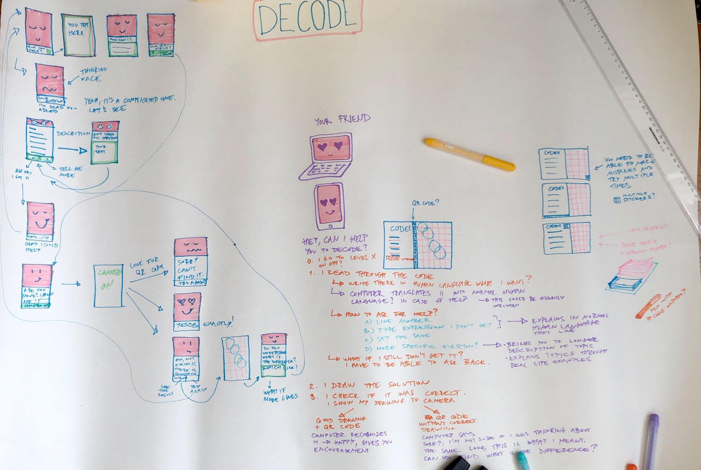
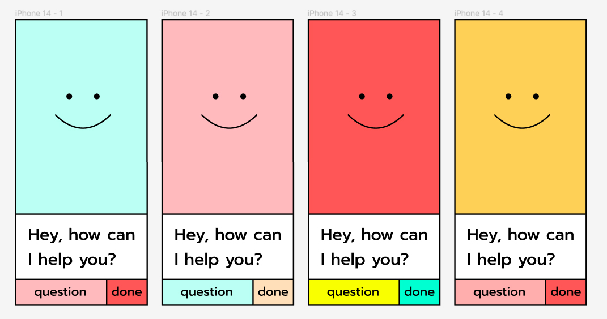
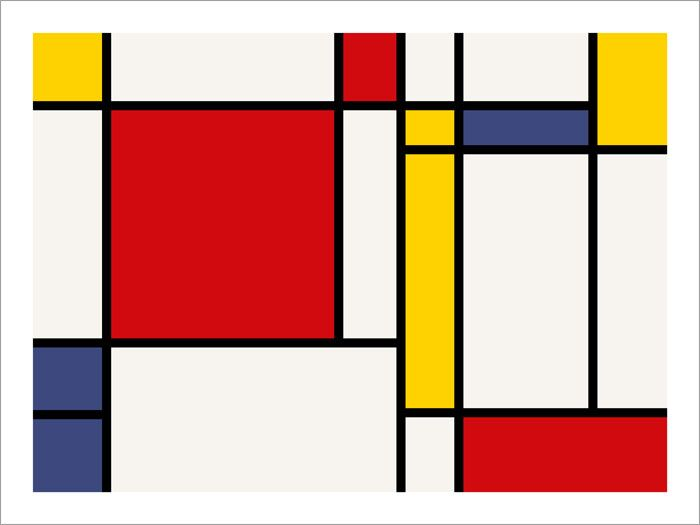
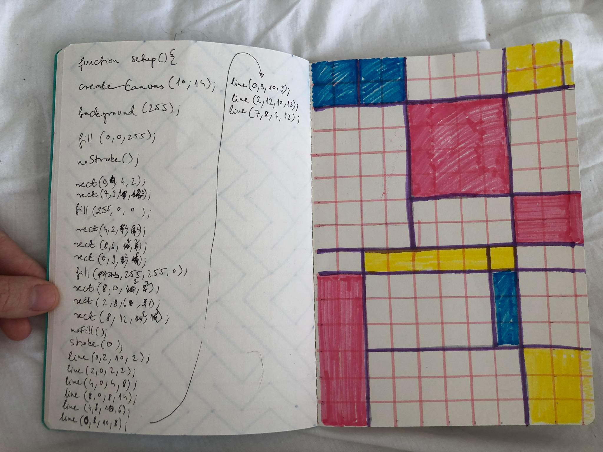

### 2022.10.28.

I applied to do my thesis this semester. Panic.

### 2022.10.29.

I made a plan on how the practical part is going to be working. I realised, that this is how I always worked in architecture school, and thinking on big papers is a lot for efficent than on miro board or anything digital. For me. 

I got very excited about the character, who is just a very simple cube face. I name it R.G., from the RGB. It is supposed to be maybe orange if it’s RG. And it’s a reference to a pixel.

I also came up with a system of how the user interface is going to work, there is always RG’s face on the screen, who doesn’t let you alone. There is a text place for him, and a button/text place for the user. These 3 things should always be there, just changing the size based on function.

I’m thinking a lot if I should go in to the Unity+Vuforia direction or the website+ML5 direction. 

I know how to use Vuforia, and it’s working well for the image recognition part. Having a downloadable app is also not bad. It can be designed only for phone.

At the same time, it would be more easily reachable and open to the public, if it’s a website, with the image recognition working in it. Also, ml5 is being made friendly, p5 is made to be friendly, I like working in these environments more, than in Unity.

I watched Daniel Shiffman’s intro to [ML5](https://www.youtube.com/watch?v=jmznx0Q1fP0) and found this trainable [image model](https://teachablemachine.withgoogle.com/train/image), which looks promising for the handdrawn drawings and people showing it in bad lighting to the camera.

I also looked at the video about [doodle classifier](https://thecodingtrain.com/tracks/ml5js-beginners-guide/ml5/9-doodleNet/1-doodleNet) that looks promising. 

Denise suggested for another project [Fungus](https://github.com/snozbot/fungus/wiki/tutorial_videos), which is a thing for unity that creates making text based games very easy, so I quickly looked into that. It looks quite simple. It also looks [customizable](https://www.youtube.com/watch?v=RdCAjpQ3iGE) how it looks.
I started a figma page, so I can sketch the UX online.

### 2022.10.29.
human language, pseudo code, code, sol lewitt instructions, more free and creative exercises too
same backwards, write code to pseudo code in level 2, same book used twice

### 2022.11.05.
A friend recommended twine for prototyping nonlinear text based stories, so I downloaded it and started to explore. It looks easy to use for making the text logic, not so easy to make it pretty, but it has html, css and javascript as well that can be changed, so there is hope. 

### 2022.11.06.
[twine tutorial to add images](https://www.youtube.com/watch?v=pXR4vC7Lmoo)
I made a drawing in my notebook based on a Mondrian drawing, wrote the code for it first on paper, than in openprocessing (I made quite some mistakes first), and started to write the twine tutorial for this exercise. 
I started a google doc for the sketch of the book.
[openprocessing](https://openprocessing.org/sketch/1726527)

### 2022.11.08.
meeting with Lena. table of content, questions for interview, preselection

### 2022.11.15.
creating preselection questionnaire, checking it with Fanni, who is an expert on doing research

### 2022.11.16.
I bought a good chair in IKEA. It's important to have a good chair to work. 
Meeting with Agustin and Mario, discussing project, painting - learning how to hold the brush
esoteric programming languages

### 2022.11.17.
finalizing preselection questionnaire, sending it for friends to fill in and review

### 2022.11.18.
sending out preselection questionnaire in Creative Code Berlin, Creative Code Budapest groups, and to some specific people

### 2022.11.17-22.
existential crisis of trying to write the first chapter
learning: I need people to be in the same room. The people should be quiet. Unfortunately, Mario left to Switzerland, who is a good quiet person in the room. László stayed, but he always wanted to go to a bar, which I said no to, but wasn't productive on writing unfortunately. 

### 2022.11.22.
I was supposed to meet Lena, but wrote up the meeting time wrongly, so I didn't. I was so stressed about this meeting, suddenly as it didn't happen, my mindset got back to normal mode, which is a relief. 

### 2022.11.23. 
Made a proper plan for the project. I know, it's a bit late.
Finalized interview questions, and trying to lure Meredith into doing the trial interview with me, but he doesn't seem to respond. I tried to select interview people based on responses.
I talked about my thesis with Helin, she suggested a talk by Casey Reas, i found a paper about it, painting as coding. 
I also realised twine alone is not enough, I make a prototype in unity now. Maybe I ask meredith's opinion.
No, I don't make a prototype, as Fungus is not on asset store anymore. No, it can work, I found a link. 

### 2022.11.24. 
I did a trial interview with Mario. 
The conclusions:
- there are some repetative questions. I asked Fanni(my researcher psychologist friend) how to deal with when they already partially answered the question by another question, but to make sure they answered.
- I'm not sure if going through the preselection questions is necessary. It takes a lot of time. Although it helps to better understand the person's history.
- My phoen turned off at some point at the end and stopped recording. 
- The interesting and most meaningful part of the conversation was afterwards, when we were already saying goodbye and had a few reflections.
- The whole interview takes a lot longer than epected, and I feel like, it didn't go as deep as I wanted to.
- I also found it good that I was talking to somebody who has been teaching coding, so he could also talk about how for their students things work.

### 2022.11.25. 
I transcribed the interview.
I tried to ways, one is just very concentratedly typing myself, I really enjoyed doing this.
Mario suggested to use google's AI for speech to text. It took some time to make it happen, and it took at least the same amount of time to transcribe with it.
It wrote some very funny things, like that Mario said he can tackle some challenges, but the AI wrote he can taco some challenges, and as Mario is mexican and keeps mentioning taco a lot, it is funny. But not so efficent in the long run. 
I'm wondering if I should have used the argentinian english option, maybe that understands accents better, although i don't think Mario would have a strong accent.

### 2022.11.26. 
I formatted the interview better, and started color coding it, but than I realised I want to ask Lena about the #-s I'm using, if it is a good idea. I've been thinking a lot about Mario's insight, that the social aspect is very important. I also mainly keep doing duolingo,because I see my friends advancing and I don't want to be behind. 

### 2022.11.28. 
I followed along twine tutorials for making the prototype. 

### 2022.11.29. 
The book arrived, that I ordered a long time ago. Code as Creative Medium. It's supernice, I've been reading it and marking almost everything, as it's about teaching creative coding. I implemented some of the quotes to my writing, also looked up things referenced in the book. 

### 2022.11.30. 
I prepared to have an interview, but I didn't send a reminder about it, so Ati forgot about it. I was reading and writing further about creative coders.

### 2022.11.31. 
I read more. I wrote more. I went through the exercises the book suggests, which ones could be relevant for my book. All the creative code community is amazing, but I'm in love with Daniel Shiffman, he has so lovely insights in the book.

### 2022.12.1. 
I had an interview with Ati. I transcribed the half of it. He showed me a plugin for googlemeets for transcribing ,it seems good, i'll try it next time. He said really interesting insights, i was very happy. I think my questions are good. His job is to make such interviews as a UX researcher, and I asked for feedback, and he said i did it well. 
We had the Thesis Team meeting with Mario and Agustin. I was mostly in the need for discussing through the technological part, as I have doubt about the Unity way to go. Also about the Twine way. We discussed, and a website sounds the most reasonable and most expandable for the future in case I want more technology.
I also realized that I want to do the book first, and then decide how to extend it with digitality. 

### 2022.12.2. 
I finished transcribing the interview with Ati, and I asked Juliane and Rachel to do an interview with me, as I realized that most of the people I interview are men. 
I feel these discussions very valuable for making a better book. I also enjoy the transcribing process, it helps to understand and review ideas more. 
I created an indesign file for the book, because it feels better to work in that and has more of a book format than google doc. I came up with two new exercises, which are more creative. I decided to have some open ended tasks, to inspire creativity. 

### 2022.12.3. 
I was thinking about the exercises for the book and made a list from the exercises from the book. 

### 2022.12.5. 
I worked on the book itself.

### 2022.12.6. 
I had a meeting with Lena. I shared the questionnaire to ctech students as well, and organized one more interview. 

### this week i don't know. 
I was reading the teaching coding book, I read some papers, i tried to write in the document. I got overly excited about the History of Logo. 

### 2022.12.12
I made an interview with Juliane, it was very useful ,because she is exactly my target audience.
I made an interview with Kazik, who i didn't know before, and he is superinteresting. He talked about ethical coding, which was very interesting. unfortunately that was not part of the interview.

### 2022.12.13
I was transcribing Kazik's interview, it's a bit hard because he uses words i don't know. I have mixed feelings about the transcribing tools, because they do still a weird job, but maybe better than nothing. 

### 2022.12.14
I finished transcribing Kazik's interview, and I started Juliane's. 

### 2022.12.16
I wrote about my method. 

### 2022.12.19
I conducted an interview with Pierre. It was very useful, he had some very cool insights. Afterwards we had an interesting conversation, he also suggested for me to try peer coding, which is coding together with another person, which sounds so much better than any other coding before. 
It really seems like, that doing coding alone is where people stop coding. I made a summary of my learnings for the book and website, how I want to go with it. Illoked for bootstrap templates for forums and chatbots, they exist, but I wasn't sure if i like them.  

### 2022.12.20
I talked through my plan with Mario, he says it's cool and had some useful input to it. I thought that it's pointless to build a forum site, if Discord already exists, and it's a platform coders use, so i tried to see how discord works, as I'm not using it too much. 
Meeting with Lena. 

### 2022.12.30.
I started to transcribe Pierre`s interview.

### 2022.12.31.
I transcribed the rest of Pierre`s interview. It was very annoying because of the constant fireworks in Neukölln. I also realised that I have to slow down the audio file as he talks very very fast. 

### 2023.01.01.
I signed up for a domestika editorial design course, because i felt that i need more inspiration for the book, and if i think about it as a magazine, that could be a good way to go. I was reading the Recoding gender book, and got into a loop of articles about female coders in the time of World War 2, and the processes behind how females became more extinct from coding. It is superinteresting. I also read about Grace Hopper, and looked for the cosmopolitan article in 1967 about Coder girls.

### 2023.01.02.
I watched further the editorial course, and I layouted the book based on the learnings from there. I came up with a concept for the chapters, organized the exercises, so now the base is in indesign already. I tried to find a good rythm of exercises. I came up with a layout concept for differentiating the title pages, creative exercises, descriptions and code. The titles have the full color, the creative exercises have a colorful frame around them. The code sites are fully white. The introduction  text titles have the chapter`s title color. I also had the concept of having the chapters with different colors: R, G, B, RG, RB, GB.

### 2023.01.03.
I finished sketching out the color schemes, and based on the printing plan of different colored pages, i restructured the chapters, so each chapter`s pages can be divided by 4. I made some designs for the chapter title pages. I looked into printing a bit, to see how these sonderfarben work.

### 2023.01.04.
I showed the current state of the book to Flo, and he had a lot of useful input to consider. We discussed printing techniques. Also we got a new concept on how to do the chapter pages. I decided that the book is also just a book of instructions, I don`t want to use any images, only make things happen by text. And the text is also rather a laidback visual element. But it should still look cool. It`s a pitty printing with cool colors is so expensive. 

### 2023.01.05.
I went to modulor to buy materials for the chapter title graphics. I created one graphic about loops that i`m very happy about. I really enjoy working with the scanner, I think i`m getting quite good at this mixture of digital and analog techniques. I wrote the introduction to the book, the table of content, the how to use the book part, the sol lewitt exercise. I had a dilemma about if i should write as "I" or "we", so I consulted with Thomas, who is an editor. I looked for domain name for the website, which came with the dilemma of teh decode name that i`ve been using for all along. The cat was sitting on my lap while i was writing, that`s next level upgrade on working conditions. I`m considering asking my flatmate to ask his exgirlfriend if the cat could stay here for the next month, to support my thesis.

### 2023.01.06.
I`ve been writing the introduction of the book. I imagined it`s faster. No. I found a nice music for concentration: Hania Rani.

### 2023.01.07.
I finished writing the introduction pages and the first chapter about introductions. I`ve sent it to Rachel and Domi to get feedback. 
I`m not fully sure if the exercises sound too random after each other, or it is understandable that I`m building them up with a logic. I try to have a good rhytm of drawing, writing text, involving others, give artistic inspiration and add creative exercises. Maybe in the bigger picture it will be understood as less random.
I also started a document for digital interactions. What to teach for RG and what discord questions can be asked to make the discussion go. 

